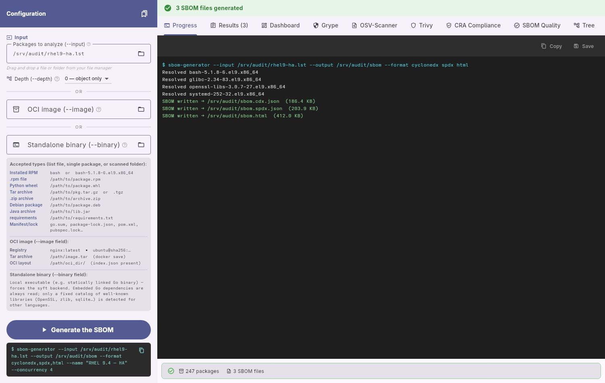
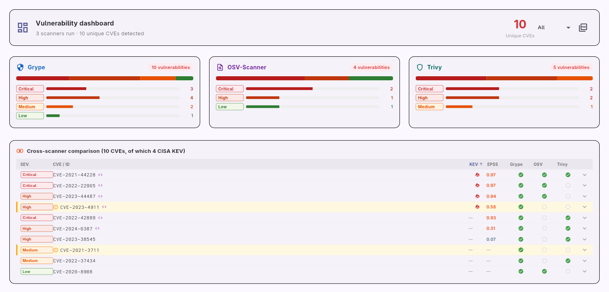
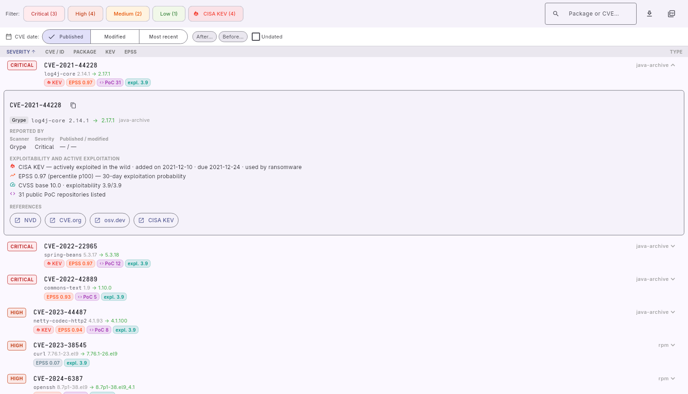
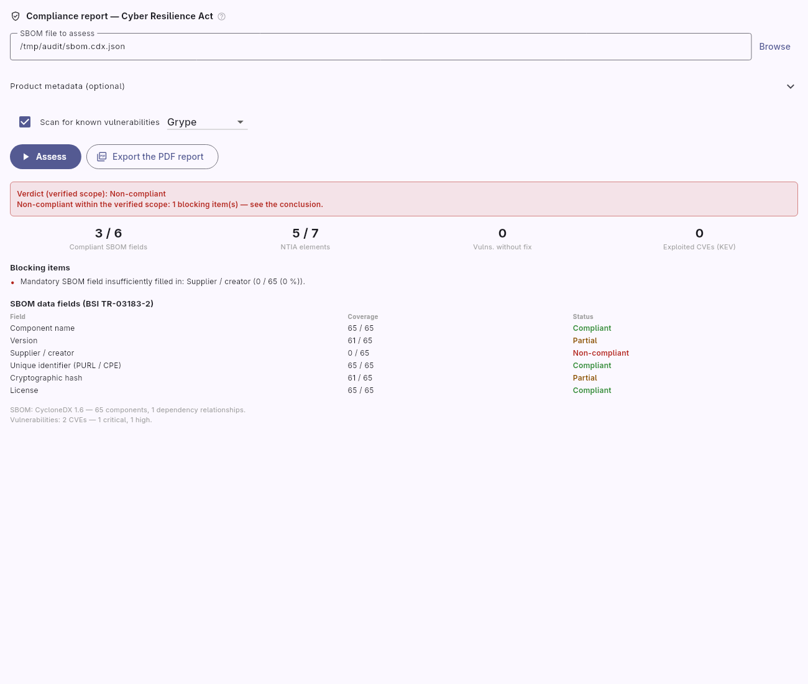
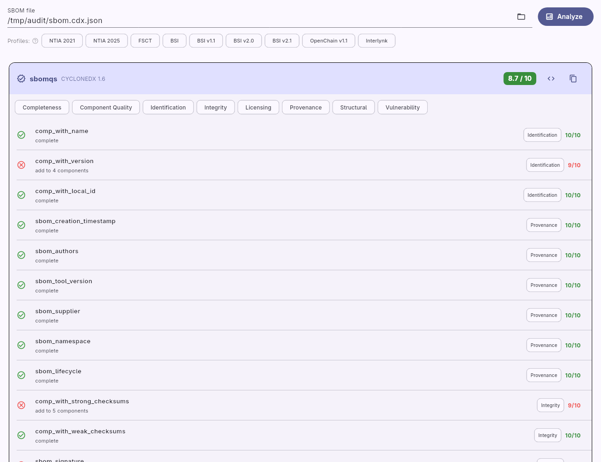

# sbom_generator

🇫🇷 [Français](README.md) · 🇬🇧 **English**

Generates an SBOM (Software Bill of Materials) from a mixed list of packages (RPM, Python, Debian, Java, Go, npm/yarn, Maven, Dart/Flutter), generic archives, or a **container image** (OCI).

---

## What the program does

**Input (`--input`)** — three possible forms:
1. a text file listing one reference per line;
2. a single archive/package (processed directly, no list file needed);
3. a **directory**, scanned recursively for all the types below.

`--input` is optional as soon as `--image` (see below) is provided; both sources can also be combined.

| Type | Examples | Required tool |
|------|----------|---------------|
| Installed RPM | `bash`, `glibc-2.42`, `openssl-libs-3.0` | `rpm` |
| Local `.rpm` file | `/tmp/mypkg-1.0-1.el9.x86_64.rpm` | `rpm` |
| Python wheel `.whl` | `/opt/wheels/requests-2.28.0-py3-none-any.whl` | `python3` |
| Python sdist `.tar.gz` / `.tgz` | `/opt/src/Django-4.2.1.tar.gz` | `python3` |
| Generic tar archive `.tar.gz` / `.tgz` | `/opt/3PP/apache-tomcat-10.1.44.tar.gz` | `python3` |
| Generic ZIP archive `.zip` | `/opt/3PP/myapp-2.0.0-linux-amd64.zip` | `python3` |
| Debian package `.deb` | `/opt/pkgs/libssl3_3.0.1_amd64.deb` | `dpkg-deb` |
| Java archive `.jar` | `/opt/libs/my-lib-1.2.3.jar` | `unzip` |
| Python requirements `.txt` | `/opt/reqs/requirements.txt` | *(none)* |
| Go modules `go.sum` / `go.mod` | `/opt/myapp/go.sum` | *(none)* |
| npm packages `package-lock.json` | `/opt/webapp/package-lock.json` (v1/v2/v3) | *(none)* |
| yarn packages `yarn.lock` | `/opt/webapp/yarn.lock` (classic and Berry) | *(none)* |
| Maven dependencies `pom.xml` | `/opt/javaapp/pom.xml` (compile scope) | *(none)* |
| Dart/Flutter lockfile `pubspec.lock` | `/opt/flutterapp/pubspec.lock` (resolved + transitive versions) | *(none)* |
| Dart/Flutter manifest `pubspec.yaml` | `/opt/flutterapp/pubspec.yaml` (direct dependencies) | *(none)* |

Lines starting with `#` are ignored. Types can be freely mixed in a single file or directory.

**Container image (`--image` / `-I`)** — an alternative or complement to `--input`:

| Form | Example |
|------|---------|
| Registry reference | `nginx:latest`, `ubuntu@sha256:…` |
| Exported tar archive | `/path/image.tar`, `.tar.gz`, `.tgz` (e.g. `docker save`) |
| OCI layout directory | `/path/oci_dir/` (contains `index.json`) |

Analysis backend of your choice (`--oci-tool`): `syft` (default, all ecosystems), `trivy` (all ecosystems), `skopeo` (manual extraction: dpkg, RPM, APK, Maven JARs, PyPI, npm), or `cdxgen` (OWASP CycloneDX Generator, all ecosystems; requires Node.js).

**Standalone binary (`--binary <file>`)** — an explicit variant of `--image`
for a local executable (e.g. a statically linked Go binary): forces
`--oci-tool syft`, the only backend able to use the metadata embedded in a
file that is not a container image (Go buildinfo via
`go-module-binary-cataloger`, syft's generic classifier for a few well-known
libraries — OpenSSL, zlib, sqlite…). It does **not** recover statically
linked dependencies without embedded metadata (home-grown C/C++, Rust without
`cargo-auditable`). `--image <file>` also works (same mechanism, syft detects
a local file source by itself) — `--binary` documents the intent and rejects
any `--oci-tool` other than `syft`.

**Descending into nested objects (`--depth`)** — with `--input`, descends into
the objects contained in the input: jars of an RPM/deb, packages and jars of a
tar/tgz/zip archive, jars of a fat jar (`BOOT-INF/lib`, `WEB-INF/lib`), and
the manifests encountered (`package-lock.json`, `go.sum`, `pom.xml`…).
`--depth 0` (default) analyses the object alone; `N` descends N levels; `all`
is unlimited (capped at 10). The merged SBOM contains the object **and**
everything it contains (`sbom_generator:nested:location` / `depth` properties,
parent → child dependencies), and one SBOM per nested object is written next
to `-o`: `<base>.nested-NN-<object>.<ext>` (`--no-nested-files` to skip
them). Extraction is bounded (size, number of files).

**One SBOM per layer (`--per-layer`)** — with `--image`, produces, in addition
to the global SBOM, one SBOM per image layer, in each requested format, next
to `-o`: `<base>.layer-NN-<digest12>.<ext>`. A layer's SBOM describes its
**delta**: added or modified components, removed components listed
separately. The global SBOM states the originating layer of each component and
references each layer SBOM (BOM-Link in CycloneDX). Two methods
(`--layer-mode`):

| Mode | Principle | Backends | Delta content |
|------|-----------|----------|---------------|
| `metadata` *(default)* | originating layer reported by the backend (trivy's `Layer.DiffID`; lowest layer where syft sees the package with `--scope all-layers`) | `syft`, `trivy` | additions |
| `rootfs` | layers applied one by one onto a cumulative rootfs (*whiteouts* included), rootfs re-analysed after each layer | all four (the only mode for `skopeo`/`cdxgen`) | additions, changes (e.g. version bump), removals |

The `rootfs` mode costs one analysis per layer; a registry image is first
copied locally via `skopeo` (falling back to podman's then Docker's local
storage for a locally built image).

**Processing:**
- RPM: 3 parallel `rpm` calls per package (`--queryformat`, `--requires`, `--provides`)
- Wheel: reads the `METADATA` file embedded in the ZIP (via `python3`)
- Tar archive: detection (Python sdist if `PKG-INFO` is present, otherwise generic), reads `LICENSE`/`COPYING`
- ZIP archive: same logic as tar, via `python3 zipfile`
- Debian package: extracts the `control` file via `dpkg-deb -f`, RFC 822 parsing
- `.jar` archive: Maven coordinates read from the embedded `pom.properties`, otherwise `META-INF/MANIFEST.MF` (Bundle-SymbolicName…), otherwise deduced from the file name; a "shaded"/uber-jar embedding relocated dependencies (each with its own `pom.properties`) yields one component per dependency in addition to the jar itself
- Requirements.txt: pure Dart parsing (PEP 503), expanded into `WheelPackage` before the main loop
- Go (`go.sum`/`go.mod`), npm (`package-lock.json`), yarn (`yarn.lock`), Maven (`pom.xml`), Dart/Flutter (`pubspec.lock`/`pubspec.yaml`): pure Dart parsing, expanded into `WheelPackage` before the main loop (same mechanism as requirements.txt, cardinality 1 file → N packages)
  - `pubspec.lock`: resolved versions + full transitive closure; all sources (`hosted`, `git`, `path`, `sdk`). `dependency: "direct dev"` dependencies are excluded (their exclusive transitives remain, as the lockfile holds no information about them).
  - `source: sdk` packages (`flutter`, `sky_engine`, `flutter_web_plugins`…): the lockfile records them all as `version: "0.0.0"` (no real version for packages shipped in the SDK) — this dummy version is **omitted** (`pkg:pub/flutter` without a version). `--sdk-version flutter=3.47.2` injects the real SDK version (repeatable, e.g. `--sdk-version dart=3.9.0`) and, in addition, records each SDK in the SBOM *toolchain* (`metadata.tools.components` in CycloneDX, `creationInfo.creators` in SPDX) — this is where the `dart` version appears, as it has no package in the lockfile.
  - **Licenses**: `pubspec.lock` contains none. The CLI reads each package's `LICENSE` file from the pub cache (`$PUB_CACHE` or `~/.pub-cache`, auto-detected; `--pub-cache <dir>` to force it, `--pub-cache ""` to disable) and, for `source: sdk` packages, from `--flutter-root`. In practice the license is filled in for almost all dependencies.
  - `pubspec.yaml`: direct dependencies of the `dependencies:` section only (the `dev_dependencies:` section is ignored); version deduced from the constraint when unambiguous (`^1.2.3`, `1.2.3`, `>=1.2.3`), otherwise empty.
  - In a directory scan, if `pubspec.lock` and `pubspec.yaml` coexist, only the `.lock` is kept.
- OCI image (`--image`): analysis via `syft`, `trivy`, `skopeo` or `cdxgen` (`--oci-tool`), outside the concurrent loop; can be combined with `--input`
  - `--per-layer`: additional per-layer analysis (`lib/image_layers.dart`); packages coming from `--input` only appear in the global SBOM
  - `cdxgen`: produces a complete CycloneDX SBOM from which only the components carrying a real ecosystem PURL are kept (cdxgen's file-by-file inventory and its cryptographic assets are discarded); the base OS is reconstructed from the `distro=` qualifier of system PURLs
- Directory: recursive traversal (symbolic links ignored); only files recognised by extension/exact name (`.rpm`, `.deb`, `.whl`, `.jar`, `.zip`, `.tar`/`.tar.gz`/`.tgz`, `requirements.txt`, `pom.xml`, `go.sum`, `go.mod`, `package-lock.json`, `yarn.lock`, `pubspec.lock`, `pubspec.yaml`) are kept — an arbitrary `.txt` is not treated as requirements unless it is named exactly `requirements.txt`

**Cryptographic hashes:** a component's hash is filled in without any network
request when the source provides it — `integrity` of npm/yarn lockfiles,
`sha256` of `pubspec.lock`, Trivy `Digest` / Syft digests (OCI images),
SHA-256+SHA-512 computed for a `.rpm`/`.deb`/`.jar`/`.whl` file passed as
input, `%{SIGMD5}` (MD5) for an installed RPM package queried by name.
Emitted as `hashes` (CycloneDX), `checksums` (SPDX 2.3), `verifiedUsing`
(SPDX 3.0). The RPM header hash is exposed separately (`rpm:header-sha256`).
Often absent for the system packages of an image.

**Component supplier (`supplier`):** taken from the source when it carries
one — `%{VENDOR}` (RPM), `Maintainer:` (Debian), `maintainer`/`Vendor` (OCI
images), `Author-email` (Python wheels), `groupId` (Maven), and, for npm, the
`author` field of each package's `package.json` in `node_modules` (absent from
the lockfile). Go/pip/pub lockfiles and `requirements.txt` carry no vendor:
`--supplier "<name>"` provides a fallback value (never overriding a detected
supplier). In SPDX 2.3, an unknown supplier is written `NOASSERTION`
(spec / NTIA / sbomqs compliant) rather than omitted.

**Output formats:**

| `-f` | Standard | Content |
|------|----------|---------|
| `cyclonedx` | CycloneDX 1.6/1.7 JSON *(1.6 by default, `--cyclonedx-version`)* | `components[]` + `dependencies[]` + `compositions[]` |
| `spdx` | SPDX 2.3 JSON | `packages[]` + `relationships[]` |
| `spdx3` | SPDX 3.0 JSON-LD | `@graph` (elements, relationships, organisations) |
| `json` | Custom JSON | full metadata + resolved dependency graph |
| `markdown` | Markdown table | `Package / Version / Architecture / License` table |
| `asciidoc` | AsciiDoc table | same as Markdown, AsciiDoc format |
| `html` | HTML report | standalone filterable and sortable report, charts per ecosystem and license |
| `csv` | CSV file (RFC 4180) | one row per package: `name,version,architecture,license,type,purl,url,vendor` |

---

## Graphical interface

A Linux interface (Flutter, [`gui/`](gui/README.en.md) folder) drives the CLI and the scanners without a command line; it is available in French and English.











These screenshots (English in `doc/screenshots/en/`, French in `doc/screenshots/`) are regenerated with
`PATH=<CLI folder>:$PATH SCREENSHOT_DIR=../doc/screenshots flutter test test/screenshot_test.dart` (from `gui/`); the CRA and Quality tabs run the real CLI and `sbomqs`.

## Installation

### Prerequisites

- Dart SDK ≥ 3.0
- `rpm` (for RPM packages)
- `python3` (for wheels and tar/zip archives)
- `dpkg-deb` (for Debian `.deb` packages)
- `unzip` (for `.jar` archives, and for `--oci-tool skopeo`)
- `syft`, `trivy`, `skopeo` or `cdxgen` (only for `--image`, depending on the chosen backend; `cdxgen` requires Node.js)
- `grype`, `osv-scanner` or `trivy` (only for the `scan` and `cra` subcommands)
- network access (only for the CVE enrichment of `scan` / `cra`: CISA KEV, EPSS,
  poc-in-github; `--no-enrich` or `SBOMGEN_OFFLINE=1` does without, 24 h cache)
- `asciidoctor-pdf` (only for `scan`/`cra` `--format pdf`; otherwise the `.adoc` is kept)
- `sbomqs` (only for `--min-quality-score`)
- `cosign` (only for `--sign`)

### Building the native executable

```bash
dart compile exe bin/sbom_generator.dart -o sbom_generator
```

---

## Usage

```
sbom_generator --input <file> [options]
sbom_generator --image <oci-image> [options]
sbom_generator --input <file> --image <oci-image> [options]
sbom_generator --binary <file> [options]
sbom_generator diff <sbom-a> <sbom-b> [--json] [--output <file>]
sbom_generator merge <sbom1> <sbom2> ... -o <output> [-n <name>]
sbom_generator convert -i <source-sbom> -f <format> -o <output>
sbom_generator validate <sbom1> [<sbom2> ...] [--strict]
sbom_generator scan --sbom <file> [options]
sbom_generator scan --image <image> [--per-layer] [options]
sbom_generator scan --package <rpm|deb|tgz|zip|jar…> [--depth N] [options]
sbom_generator cra --sbom <file> [options]

Options:
  -i, --input              Input file (required if --image is absent)
  -I, --image              Container image to analyse: registry, tar archive
                           (.tar/.tar.gz/.tgz) or OCI layout directory
  -b, --binary             Local binary to analyse directly (e.g. statically
                           linked Go executable); forces --oci-tool syft
      --oci-tool            OCI analysis backend: syft (default) | trivy | skopeo | cdxgen
      --per-layer          With --image: one SBOM per layer in addition to the global one
                           (<base>.layer-NN-<digest12>.<ext>, layer delta)
      --layer-mode         --per-layer method: metadata (default, syft/trivy)
                           | rootfs (re-analysis after each layer; forced for
                           skopeo and cdxgen)
      --depth              Depth of descent into the nested objects of
                           --input: 0 (default, the object alone) | N levels | all
      --no-nested-files    With --depth: no SBOM per nested object
                           (<base>.nested-NN-<object>.<ext>), merged one only
  -o, --output             Output file (default: sbom.json)
                           With several formats, used as the base name
  -f, --format             Format(s), comma-separated:
                             cyclonedx | spdx | spdx3 | json | markdown | asciidoc | html | csv
                           Example: -f cyclonedx,spdx,html
  -n, --name               SBOM document name / root component
      --supplier           Default supplier for components whose source carries
                           no vendor (never overrides a detected supplier)
  -d, --rpm-dir            Root directory to search for .rpm files
                           (resolves bare RPM names; does not apply to .whl/.tar)
  -c, --concurrency        Number of tasks processed in parallel (0 = unlimited, default: 4)
  -l, --license-map        License override file (one "name: SPDX-expression" per line)
      --deny-license       Reject components whose license matches the pattern
                           (repeatable, partial SPDX matching) — exit code 2 on violation
      --sdk-version        Actual version of a Dart/Flutter SDK (<sdk>=<version>, repeatable):
                           applies the version to the matching source: sdk packages AND
                           adds each SDK to metadata.tools (CycloneDX) / creators (SPDX)
      --pub-cache          Pub cache to read the LICENSE of a pubspec.lock's packages
                           (default: $PUB_CACHE then ~/.pub-cache; "" to disable)
      --flutter-root       Flutter SDK root, for the LICENSE of source: sdk packages
      --min-quality-score  Minimum required sbomqs score (e.g. 7.5) — exit code 2 if insufficient
      --sign               Sign the SBOM files with cosign after generation
      --cyclonedx-version  CycloneDX version generated: 1.6 (default) or 1.7
      --tlp                TLP classification of the BOM (CycloneDX 1.7 only)
      --patent-map         Patent declarations per package (CycloneDX 1.7 only)
      --lang               Message language: fr | en (default: SBOM_LANG, then LC_ALL/LANG, otherwise fr)
  -v, --verbose            Show details
      --version            Show the version
  -h, --help               Show help
```

### Subcommands

```bash
# Compare two SBOMs (additions, removals, version updates)
sbom_generator diff before.cdx.json after.cdx.json
sbom_generator diff before.cdx.json after.cdx.json --json -o diff.json

# Merge several SBOMs into one (deduplication by PURL)
sbom_generator merge base.cdx.json extra.cdx.json -o merged.cdx.json
sbom_generator merge a.cdx.json b.cdx.json c.cdx.json -o merged.cdx.json -n "Complete system"

# Convert an existing SBOM to one or more formats, without re-scanning
sbom_generator convert -i sbom.cdx.json -f spdx,csv -o report

# Validate the structure of one or more SBOMs (0 = all valid, 1 = at least one invalid)
sbom_generator validate sbom.cdx.json sbom.spdx.json
sbom_generator validate --strict sbom.cdx.json

# Look up the known vulnerabilities of an already generated SBOM (grype/osv/trivy)
sbom_generator scan --sbom sbom.cdx.json
sbom_generator scan --sbom sbom.cdx.json --scanner all --cve-after 2024-01-01

# Each CVE is enriched (CISA KEV, EPSS, public PoC, CVSS exploitability);
# filter / prioritise:
sbom_generator scan --sbom sbom.cdx.json --only-kev --sort risk
sbom_generator scan --sbom sbom.cdx.json --epss-min 0.1
sbom_generator scan --sbom sbom.cdx.json --no-enrich   # offline (CI)

# Cross-scanner summary report (markdown | asciidoc | pdf), with a
# "Risk prioritisation" section and kev/epss/poc properties in SARIF
sbom_generator scan --sbom sbom.cdx.json --scanner all -f pdf -o scan-report.pdf

# Scan an RPM and the jars it contains directly (2 levels): the SBOM
# is generated (--depth) then scanned; each CVE names the object containing it
sbom_generator scan --package app-1.0-1.x86_64.rpm --depth 2 --scanner all

# CVEs per image layer (per-layer SBOMs generated on the fly):
# attribution to the package's originating layer, or scan of each layer
sbom_generator scan --image ./app.tar --per-layer --scanner all
sbom_generator scan --image ./app.tar --per-layer --layer-scan each --layer-mode rootfs

# Cyber Resilience Act (EU 2024/2847) compliance report — automatically
# verifiable scope: SBOM completeness (BSI TR-03183-2, NTIA minimum elements),
# known vulnerabilities and fixes, actively exploited CVEs (ENISA 24 h
# notification trigger, art. 14)
sbom_generator cra --sbom sbom.cdx.json --config cra.yaml -o cra-report.pdf
sbom_generator cra --sbom sbom.cdx.json --no-scan --format json   # exit 2 if non-compliant
```

### Examples

```bash
# CycloneDX 1.6 (default)
./sbom_generator -i packages.txt -o sbom.cdx.json

# SPDX 2.3
./sbom_generator -i packages.txt -f spdx -o sbom.spdx.json

# SPDX 3.0 JSON-LD
./sbom_generator -i packages.txt -f spdx3 -o sbom.spdx3.jsonld

# Custom JSON with a document name
./sbom_generator -i packages.txt -f json -n "My Application" -o sbom.json -v

# Markdown license table
./sbom_generator -i packages.txt -f markdown -o licenses.md

# Interactive HTML report
./sbom_generator -i packages.txt -f html -n "My Application" -o sbom.html

# Generate CycloneDX + SPDX + HTML in a single pass
./sbom_generator -i packages.txt -f cyclonedx,spdx,html -o sbom

# CSV report
./sbom_generator -i packages.txt -f csv -o report.csv

# Analyse a container image (remote registry, via syft by default)
./sbom_generator -I nginx:latest -o nginx.cdx.json

# Analyse an exported tar archive (docker save), trivy backend
./sbom_generator -I ./ubuntu.tar --oci-tool trivy -f spdx -o ubuntu.spdx.json

# Analyse an image via cdxgen (OWASP CycloneDX Generator)
./sbom_generator -I nginx:latest --oci-tool cdxgen -o nginx.cdx.json

# Combine an OCI image and a list of extra packages
./sbom_generator -I nginx:latest -i extra_pkgs.txt -o sbom.cdx.json

# An RPM and the jars it contains: merged SBOM + one SBOM per jar
./sbom_generator -i app-1.0-1.x86_64.rpm --depth 1 -o out/app.cdx.json
# → out/app.cdx.json, out/app.nested-01-<jar>.cdx.json, …

# One SBOM per image layer (delta of each layer), in addition to the global one
./sbom_generator -I ./app.tar --per-layer -f cyclonedx,html -o out/app
# → out/app.cdx.json, out/app.layer-01-74d97c428c51.cdx.json, …

# Same with changes and removals (rootfs re-analysis per layer)
./sbom_generator -I ./app.tar --per-layer --layer-mode rootfs -o out/app

# Analyse a statically linked binary (e.g. Go executable) — embedded
# dependencies read via syft, no registry nor container
./sbom_generator --binary /usr/local/bin/my-app -o app.cdx.json

# Resolve RPM names from a local directory (no installed rpm required)
./sbom_generator -i packages.txt -d /mnt/repo -o sbom.cdx.json

# --input pointing directly to a directory: recursive scan of all recognised
# types (.jar, .rpm, .deb, .whl, archives, manifests…)
./sbom_generator -i /opt/app/libs -o sbom.cdx.json

# --input pointing directly to a single .jar
./sbom_generator -i /opt/app/libs/my-lib-1.2.3.jar -o sbom.cdx.json

# --input pointing directly to a single manifest (Dart/Flutter lockfile,
# requirements.txt, go.sum, package-lock.json, pom.xml…)
./sbom_generator -i /opt/flutterapp/pubspec.lock -o sbom.cdx.json

# Same, providing the real Flutter SDK version (otherwise source: sdk
# packages come out without a version)
./sbom_generator -i /opt/flutterapp/pubspec.lock --sdk-version flutter=3.47.2 -o sbom.cdx.json

# Process 8 inputs in parallel (mixed RPM + .deb + .whl + .txt list)
./sbom_generator -i packages.txt -c 8 -o sbom.cdx.json

# Disable the parallelism limit (all inputs simultaneously)
./sbom_generator -i packages.txt -c 0 -o sbom.cdx.json

# License overrides (text file: one "name: SPDX-expression" per line)
./sbom_generator -i packages.txt -l overrides.txt -o sbom.cdx.json

# CI/CD policies: reject GPL and AGPL, require an sbomqs score ≥ 7.0
./sbom_generator -i packages.txt -o sbom.cdx.json \
  --deny-license GPL --deny-license AGPL \
  --min-quality-score 7.0
# Exit code 2 on violation; 0 if OK

# Sign the SBOMs with cosign after generation
./sbom_generator -i packages.txt -f cyclonedx,spdx -o sbom --sign

# CycloneDX 1.7 with TLP classification and patent declarations
./sbom_generator -i packages.txt --cyclonedx-version 1.7 --tlp AMBER \
  --patent-map patents.txt -o sbom.cdx.json

# English messages and reports (default: follows SBOM_LANG, LC_ALL, LANG)
./sbom_generator --lang en -i packages.txt -o sbom.cdx.json
SBOM_LANG=en ./sbom_generator scan --sbom sbom.cdx.json -f pdf -o scan-report.pdf

# Compare two SBOMs
./sbom_generator diff old.cdx.json new.cdx.json
./sbom_generator diff old.cdx.json new.cdx.json --json -o diff.json

# Merge several SBOMs
./sbom_generator merge base.cdx.json extra.cdx.json -o merged.cdx.json -n "Complete system"
```

### Language (FR / EN)

The messages, `--help` text and the readable reports (`scan` summary, `cra`
report, license report, HTML/Markdown/AsciiDoc tables) are available in French
and English. The language is chosen, in order, by `--lang fr|en`, the
`SBOM_LANG` environment variable, then `LC_ALL` / `LC_MESSAGES` / `LANG`;
French by default. The *contents* of the SBOMs (property names, formats,
values) and the machine-readable outputs (JSON keys, SARIF rule ids,
`SBOM written → …` line) are never translated. The GUI forwards its own
language to the CLI it launches.

### License override file example (`overrides.txt`)

```text
# License overrides — format: package_name: SPDX-expression
libssl3: Apache-2.0
mongodb: SSPL-1.0
my-internal-lib: LicenseRef-Proprietary
```

Each `name: expression` line replaces the automatically detected license for the package of that name. Lines starting with `#` are ignored.

### Patent file example (`patents.txt`, CycloneDX 1.7 only)

```text
# Patent declarations — format: package_name: number|jurisdiction|status|assertion_type
openssl: US1234567|US|granted|license
my-internal-lib: US7654321|US|pending|ownership
```

- `jurisdiction`: 2-letter WIPO ST.3 code (`US`, `EP`, `JP`…)
- `status`: `pending`, `granted`, `revoked`, `expired`, `lapsed`, `withdrawn`, `abandoned`, `suspended`, `reinstated`, `opposed`, `terminated`, `invalidated`, `in-force`
- `assertion_type`: `ownership`, `license`, `third-party-claim`, `standards-inclusion`, `prior-art`, `exclusive-rights`, `non-assertion`, `research-or-evaluation`

Requires `--cyclonedx-version 1.7` (the 1.6 schema has no `patentAssertions` field).

### Input file example

```text
# Bare RPM names — resolved via --rpm-dir or queried in the installed database
bash
glibc
openssl-libs

# Local RPM files (absolute path, always used directly)
/mnt/repo/mypkg-1.0-1.el9.x86_64.rpm

# Python wheels
/opt/wheels/requests-2.28.0-py3-none-any.whl
/opt/wheels/numpy-1.24.0-cp311-cp311-linux_x86_64.whl

# Python sdist
/opt/src/Django-4.2.1.tar.gz

# Third-party binary tar archives (Tomcat, MariaDB, MongoDB…)
/opt/3PP/apache-tomcat-10.1.44.tar.gz
/opt/3PP/mariadb-11.4.8-linux-systemd-x86_64.tar.gz
/opt/3PP/mongodb-linux-x86_64-rhel8-8.0.12.tgz

# Generic ZIP archive
/opt/3PP/myapp-2.0.0-linux-amd64.zip

# Debian packages
/opt/pkgs/libssl3_3.0.1_amd64.deb

# Python requirements (the file's packages are included directly)
/opt/reqs/requirements.txt
```

---

## Behaviour by archive type (tar and zip)

| Archive content | Result |
|-----------------|--------|
| `PKG-INFO` or `*.dist-info/METADATA` | Python sdist → PURL `pkg:pypi/…`, full metadata |
| `LICENSE` / `COPYING` / `LICENSE-*` (without PKG-INFO) | Generic archive → PURL `pkg:generic/…`, license identified from the file |
| Neither | Generic archive → name/version deduced from the file name, unknown license |

Applies to `.tar.gz`, `.tgz`, `.tar` and `.zip` formats. `.zip` archives containing a Python `METADATA` are processed as Python sdists.

**Extracting the name/version from the file name** (generic archives):

The first version segment (`\d+\.\d+`) delimits the name. Known platform suffixes (`linux`, `x86_64`, `rhel8`, `systemd`, etc.) are removed from the name.

```
apache-tomcat-10.1.44.tar.gz           → name=apache-tomcat    ver=10.1.44  arch=any
mariadb-11.4.8-linux-systemd-x86_64   → name=mariadb           ver=11.4.8   arch=x86_64
mongodb-linux-x86_64-rhel8-8.0.12     → name=mongodb           ver=8.0.12   arch=x86_64
mongodb-database-tools-rhel88-x86_64-100.13.0 → name=mongodb-database-tools  ver=100.13.0
mongosh-2.5.6-linux-x64               → name=mongosh           ver=2.5.6    arch=x86_64
```

---

## Project structure

```
sbom_generator/
├── bin/
│   └── sbom_generator.dart      # CLI entry point + subcommands
│                                #   diff/merge/convert/validate/scan
├── lib/
│   ├── i18n.dart                # FR / EN localisation of messages (tr(), --lang)
│   ├── models.dart              # Package, RpmPackage, WheelPackage, DebPackage,
│   │                            #   OciPackage, PackageHash, PackageDependency, generateUuidV4()
│   ├── hash_utils.dart          # Hash collection/normalisation (SRI, Digest, files)
│   ├── rpm_parser.dart          # rpm queries (3 calls in Future.wait)
│   ├── wheel_parser.dart        # Reading .whl files (ZIP + RFC 822)
│   ├── tar_parser.dart          # Reading .tar/.tar.gz/.tgz
│   ├── zip_parser.dart          # Reading generic .zip
│   ├── deb_parser.dart          # Reading .deb (dpkg-deb -f)
│   ├── jar_parser.dart          # Maven coordinates of a .jar (unzip -p pom.properties)
│   ├── requirements_parser.dart # Python requirements.txt parsing (pure Dart)
│   ├── go_parser.dart           # go.sum / go.mod parsing (pure Dart)
│   ├── npm_parser.dart          # package-lock.json v1/v2/v3 parsing (pure Dart)
│   ├── yarn_parser.dart         # yarn.lock classic and Berry parsing (pure Dart)
│   ├── maven_parser.dart        # pom.xml parsing (pure Dart, light XML extraction)
│   ├── pubspec_parser.dart      # pubspec.lock / pubspec.yaml parsing (pure Dart)
│   ├── oci_parser.dart          # OCI image analysis (syft / trivy / skopeo / cdxgen)
│   │                            #   skopeo: RPM, dpkg, APK, Maven JARs, PyPI, npm
│   │                            #   cdxgen: native CycloneDX SBOM, filtered to real PURLs
│   ├── archive_helpers.dart     # Shared tar/zip helpers (parseFilename, identifyLicense)
│   ├── license_normalizer.dart  # Centralised SPDX normalisation (LicenseNormalizer)
│   ├── spdx_license_ids.dart    # SPDX License List snapshot (id vs name safeguard)
│   ├── sbom_diff.dart           # SBOM comparison (SbomDiffer)
│   ├── sbom_merger.dart         # SBOM merging (SbomMerger)
│   ├── sbom_reader.dart         # Re-reading an existing SBOM (convert subcommand)
│   ├── scan_report_generator.dart # Cross-scanner summary report (scan -f md/adoc/pdf)
│   ├── vuln_enrichment.dart     # CVE enrichment: CISA KEV, EPSS, PoC, CVSS exploitability
│   ├── cra_report.dart          # Cyber Resilience Act compliance report (cra subcommand)
│   ├── policy_checker.dart      # CI/CD license and quality score checks
│   ├── cyclonedx_generator.dart # CycloneDX 1.6/1.7 JSON format
│   ├── spdx_generator.dart      # SPDX 2.3 JSON format
│   ├── spdx3_generator.dart     # SPDX 3.0 JSON-LD format
│   ├── simple_json_generator.dart  # Custom JSON format
│   ├── markdown_generator.dart  # Markdown license table
│   ├── asciidoc_generator.dart  # AsciiDoc license table
│   ├── html_generator.dart      # Interactive HTML report (filterable, sortable)
│   └── csv_generator.dart       # CSV export (RFC 4180)
├── test/
│   ├── unit/                    # Tests without real subprocesses (parsers, generators,
│   │                            #   licenses, policies…) — see doc/developer.en.adoc
│   └── integration/             # Tests on real archives/tools (@TestOn('posix'))
├── example/
│   └── 3PP/                     # Third-party archive examples
├── doc/
│   ├── developer.adoc           # Detailed developer documentation (FR)
│   ├── developer.en.adoc        # Detailed developer documentation (EN)
│   ├── usage.adoc               # Detailed usage guide (FR)
│   └── usage.en.adoc            # Detailed usage guide (EN)
├── pubspec.yaml
├── README.md                    # French
└── README.en.md                 # English
```

---

## PURLs generated per package type

| Type | PURL | Example |
|------|------|---------|
| RPM | `pkg:rpm/<name>@<ver>?arch=<arch>` | `pkg:rpm/bash@5.1.8-6.el9?arch=x86_64` |
| Python (wheel / sdist / requirements.txt / OCI) | `pkg:pypi/<name>@<ver>` | `pkg:pypi/requests@2.28.2` |
| Generic tar/zip archive | `pkg:generic/<name>@<ver>` | `pkg:generic/apache-tomcat@10.1.44` |
| Debian package | `pkg:deb/<name>@<ver>?arch=<arch>` | `pkg:deb/libssl3@3.0.1?arch=amd64` |
| Java Maven (standalone `.jar`, `pom.xml`, or OCI via skopeo) | `pkg:maven/<groupId>/<artifactId>@<ver>` | `pkg:maven/org.yaml/snakeyaml@2.0` |
| Go (`go.sum` / `go.mod`) | `pkg:golang/<module>@<ver>` | `pkg:golang/github.com/gorilla/mux@1.8.1` |
| npm / yarn (`package-lock.json`, `yarn.lock`, or OCI via skopeo) | `pkg:npm/<name>@<ver>` | `pkg:npm/semver@7.5.4` |
| Dart/Flutter (`pubspec.lock` / `pubspec.yaml`) | `pkg:pub/<name>@<ver>` | `pkg:pub/provider@6.1.2` |
| Container image (`--image`) | PURL provided by the analysis tool (syft/trivy/cdxgen), or rebuilt from the detected ecosystem | `pkg:apk/alpine/musl@1.2.4-r2` |

## License

Distributed under the **GNU LGPL v3** (`LGPL-3.0-only`) — see [`LICENSE`](LICENSE); the LGPL v3 supplements the GPL v3, whose text is in [`COPYING`](COPYING). The GUI (`gui/`) is covered by the same license.

## Security

To report a vulnerability, see [`SECURITY.md`](SECURITY.md).
